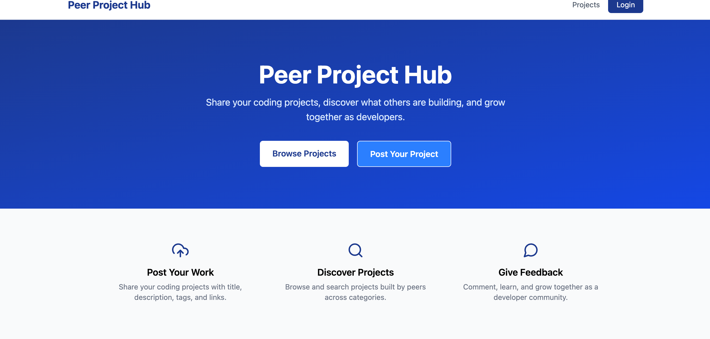
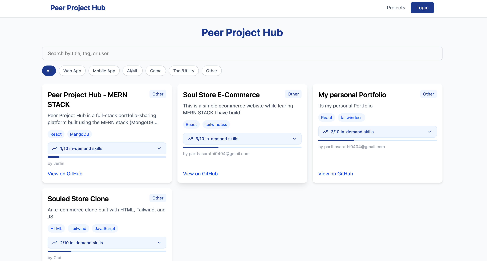
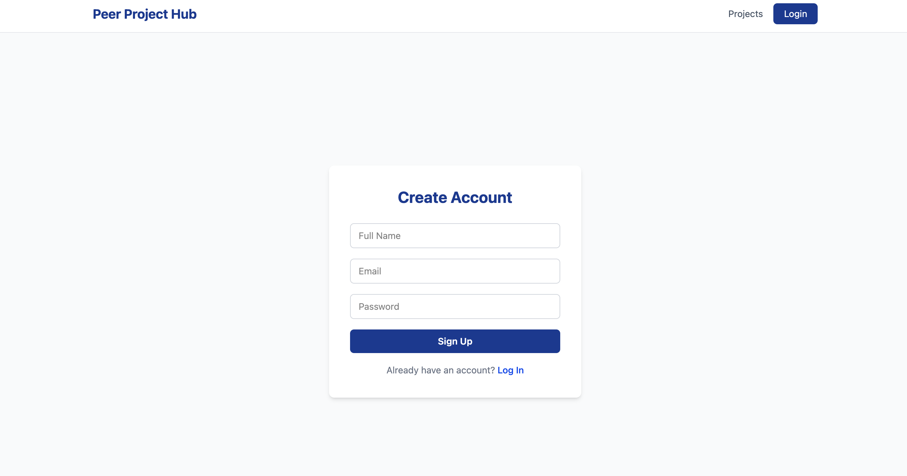
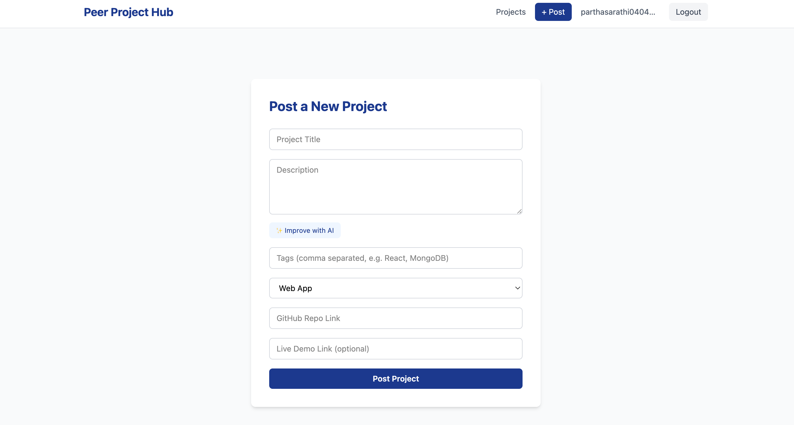

# Peer Project Hub

A full-stack MERN platform where developers share their coding projects, discover what others are building, and give each other feedback through comments.

🔗 **Live app:** [peer-project-hub-lake.vercel.app](https://peer-project-hub-lake.vercel.app)
🔗 **Backend API:** [peer-project-hub-vnn9.onrender.com](https://peer-project-hub-vnn9.onrender.com)
💻 **Repository:** [github.com/cibi0404/peer-project-hub](https://github.com/cibi0404/peer-project-hub)



---

## Tech Stack


**Frontend:** React, Vite, React Router, Tailwind CSS, Axios, react-icons, react-hot-toast
**Backend:** Node.js, Express, MongoDB with Mongoose
**Auth:** Firebase Authentication (client) + Firebase Admin SDK (server-side token verification)
**AI:** Google Gemini API for AI-assisted project description writing
**Deployment:** Render (backend) · Vercel (frontend) · MongoDB Atlas (database)

---

## Features

### Core
- 🔐 **Authentication** — sign up and log in with Firebase (email/password), with display names shown across the app
- 📝 **Project CRUD** — create, view, edit, and delete your own projects; ownership is enforced **server-side** via Firebase token verification, not just hidden UI buttons
- 📰 **Project feed** — browse all projects, most recent first
- 🔍 **Search & category filter** — search by title, tag, or author; filter by category (Web App, Mobile App, AI/ML, Game, Tool/Utility, Other)
- 💬 **Comments** — logged-in users can comment on any project
- 📱 **Responsive design** — mobile-friendly layout built with Tailwind

### Standout additions
- ✨ **AI description improver** — one click sends a rough project description to Google Gemini, which returns a polished, professional rewrite while preserving the original technical facts
- 📊 **In-demand skills match** — each project is scored against a curated list of currently in-demand tech skills, giving job-seeking developers a quick signal on how their stack lines up with the market
- 🎨 **Consistent design system** — a single deep-blue theme applied across every page, with Feather icons instead of emoji

---

## Screenshots

| Home | Projects Feed |
|---|---|
|  |  |

| Create Project (with AI) | Project Details & Comments |
|---|---|
|  |  |

---

## Project Structure

```
peer-project-hub/
├── client/                        # React frontend (Vite)
│   └── src/
│       ├── components/
│       │   ├── Navbar.jsx         # Top nav, responsive, shows auth state
│       │   └── SkillMatchBadge.jsx
│       ├── context/
│       │   └── AuthContext.jsx    # Global auth state via Firebase
│       ├── pages/
│       │   ├── Home.jsx
│       │   ├── Feed.jsx           # Projects browse page + search/filter
│       │   ├── Auth.jsx
│       │   ├── CreateProject.jsx  # Includes "Improve with AI" button
│       │   └── ProjectDetails.jsx # Edit/Delete (owner only) + comments
│       └── utils/
│           ├── api.js             # Axios instance + auth-token interceptor
│           ├── firebase.js
│           └── skillsData.js
│
└── server/                        # Express backend
    ├── config/
    │   └── firebaseAdmin.js       # Reads credentials from env var (prod) or file (dev)
    ├── controllers/
    │   ├── projectController.js
    │   ├── commentController.js
    │   └── aiController.js        # Calls the Gemini API
    ├── middleware/
    │   └── verifyToken.js         # Verifies Firebase ID tokens on protected routes
    ├── models/
    │   ├── Project.js
    │   └── Comment.js
    ├── routes/
    │   ├── projectRoutes.js
    │   ├── commentRoutes.js
    │   └── aiRoutes.js
    └── server.js
```

---

## API Overview

| Method | Endpoint | Auth Required | Description |
|---|---|---|---|
| GET | `/api/projects` | No | Get all projects, most recent first |
| GET | `/api/projects/:id` | No | Get a single project |
| POST | `/api/projects` | Yes | Create a project |
| PUT | `/api/projects/:id` | Yes (owner only) | Update a project |
| DELETE | `/api/projects/:id` | Yes (owner only) | Delete a project |
| GET | `/api/comments/:projectId` | No | Get comments for a project |
| POST | `/api/comments` | No | Post a comment |
| POST | `/api/ai/improve-description` | No | Get an AI-improved description |

---

## Running Locally

### Prerequisites
- Node.js 18+
- A MongoDB Atlas cluster
- A Firebase project with Email/Password authentication enabled
- A Google Gemini API key ([aistudio.google.com](https://aistudio.google.com))

### Backend

```bash
cd server
npm install
```

Create `server/.env`:

```
MONGO_URI=your_mongodb_connection_string
PORT=5001
GEMINI_API_KEY=your_gemini_api_key
```

Add your Firebase service account key as `server/firebase-service-account.json` (Firebase Console → Project Settings → Service Accounts → Generate new private key).

```bash
npm run dev
```

### Frontend

```bash
cd client
npm install
```

Update `client/src/utils/firebase.js` with your Firebase web app config. Create `client/.env`:

```
VITE_API_URL=http://localhost:5001/api
```

```bash
npm run dev
```

Frontend runs at `http://localhost:5173`, API at `http://localhost:5001`.

---

## Deployment

- **Backend (Render):** Web Service, Root Directory `server`, Build Command `npm install`, Start Command `npm start`. Environment variables: `MONGO_URI`, `GEMINI_API_KEY`, `FIREBASE_SERVICE_ACCOUNT` (the service account JSON as a single-line string — `firebaseAdmin.js` reads this in production and falls back to the local file in development).
- **Frontend (Vercel):** Root Directory `client`, framework auto-detected as Vite. Environment variable: `VITE_API_URL` pointing at the live Render backend URL.

Both platforms auto-deploy on push to `main`.

---

## Learning Outcomes

Built as a hands-on exercise in:
- End-to-end CRUD across a full MERN stack, deployed and publicly accessible
- Authentication *and* authorization — verifying identity with Firebase, then separately enforcing ownership on every write route server-side
- Integrating a third-party AI API (Google Gemini) into a real product feature, with the API key kept server-side only
- Debugging real deployment issues: a missing `package.json` dependency that only surfaced on a fresh Render build, and a Vite environment variable that only takes effect at build time, not runtime
- Clean environment/configuration management across local, Render, and Vercel environments

---

## Author

**Parthasarathi M (Cibi)**
Frontend Developer, transitioning into AI Full-Stack Development
[GitHub](https://github.com/cibi0404) · [Portfolio](https://portfolio-partha-psi.vercel.app)